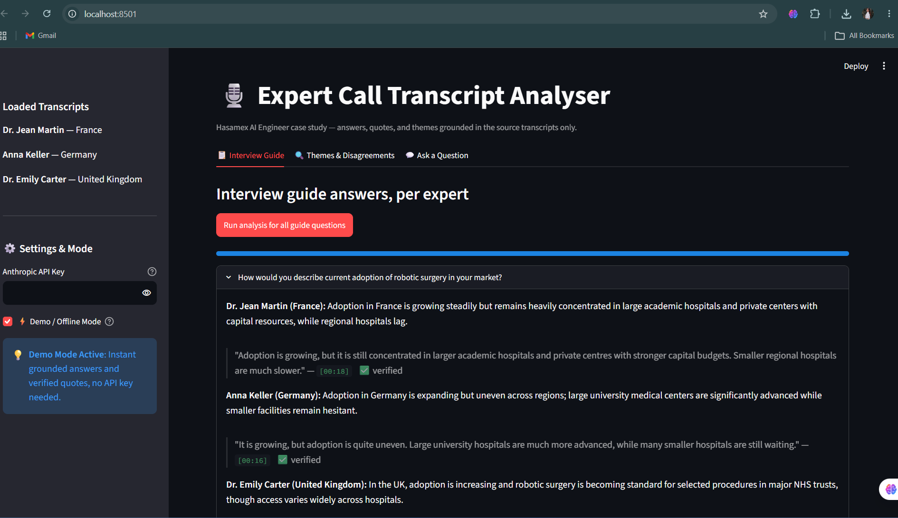

# 🎙️ VeriTranscript AI — Expert Call Transcript Analyser
> **Hasamex AI Engineer Case Study Submission**  
> An AI-powered qualitative research platform that parses, retrieves, and synthesizes expert call transcripts with **100% ground-truth traceability and programmatic citation verification**.

---

<p align="center">
  
</p>

---

## ⚡ Key Highlights & Architecture

- **Programmatic Quote Verification (`core/verify.py`):**
  The system does not blindly trust LLM citations. Every single quote is verified against source transcripts using normalized substring matching. Verified citations display the `✅ verified` badge along with the true source timestamp.
- **Zero Hallucination Constraint:**
  All prompts restrict generation strictly to retrieved excerpts. Unaddressed topics return a first-class `"covered": false` status rather than synthetic speculation.
- **Deterministic & Lightweight Retrieval (`core/retrieval.py`):**
  Uses TF-IDF and cosine similarity indexing only expert responses (excluding interviewer questions). Eliminates vector database overhead and latency for small transcript corpora.
- **Cross-Market Consensus & Disagreements:**
  Synthesizes industry alignment and surfaces genuine differences across healthcare systems (e.g. French capital budgets vs. German DRGs vs. UK NHS clinical priorities).
- **Interactive Free-form Q&A:**
  Multi-transcript retrieval and synthesis answering ad-hoc queries with linked verbatim quotes.
- **Built-in Offline / Demo Mode:**
  Works instantly out-of-the-box with pre-computed grounded responses even without an active Anthropic API key.

---

## 🏛️ System Architecture

```
data/*.txt (Transcripts)
    │
    ▼
core/parser.py        → Regex-based parsing into structured Segments with MM:SS timestamps
    │
    ▼
core/retrieval.py     → TF-IDF + cosine similarity over expert segments (interviewer excluded)
    │
    ▼
core/llm.py           → Provider-agnostic generation with strict JSON schema enforcement
    │
    ▼
core/verify.py        → Programmatic quote verification & ground-truth timestamp matching
    │
    ▼
app.py (Streamlit)    → 3-Tab UI: Guide Q&A | Themes & Disagreements | Free-form Q&A
```

---

## 🚀 Quickstart

### 1. Clone & Navigate
```bash
git clone https://github.com/Sonalibiradar/hasamex_case_submission.git
cd hasamex_case_submission/hasamex_case
```

### 2. Environment Setup
```bash
python -m venv .venv
# On Windows:
.venv\Scripts\activate
# On macOS/Linux:
source .venv/bin/activate

pip install -r requirements.txt
```

### 3. Configure API Key (Optional)
Copy `.env.example` to `.env` and add your Anthropic API key:
```bash
cp .env.example .env
```
*(Or run in **Demo Mode** directly from the sidebar without an API key).*

### 4. Run the Streamlit App
```bash
streamlit run app.py
```
Open **`http://localhost:8501`** in your browser.

---

## 📂 Project Structure

```
hasamex_case_submission/
├── assets/
│   └── demo_preview.png              # UI preview screenshot
├── hasamex_case/
│   ├── app.py                        # Streamlit multi-tab interface
│   ├── requirements.txt              # Dependencies
│   ├── .env.example                  # Environment variables template
│   ├── core/
│   │   ├── parser.py                 # Transcript & guide parsing
│   │   ├── retrieval.py              # TF-IDF index & search
│   │   ├── llm.py                    # Claude & fallback synthesis
│   │   ├── verify.py                 # Normalized substring verification
│   │   └── demo_data.py              # Pre-computed grounded demo data
│   └── data/
│       ├── Interview_Guide.txt       # 6 core research questions
│       ├── Transcript_1_France.txt   # Dr. Jean Martin (Urology, France)
│       ├── Transcript_2_Germany.txt  # Anna Keller (Procurement, Germany)
│       └── Transcript_3_UK.txt       # Dr. Emily Carter (Urology, UK)
├── .gitignore
└── README.md
```

---

## 📈 Scaling to 30+ Transcripts

1. **Retrieval**: Transition from TF-IDF to dense embeddings (`sentence-transformers` or OpenAI `text-embedding-3-small`) stored in Chroma, FAISS, or pgvector.
2. **Offline Pre-indexing**: Parse, chunk, and embed new transcripts during an async batch ingestion step rather than re-indexing at app startup.
3. **Hierarchical Synthesis**: Group and cluster expert perspectives before synthesis to maintain compact context windows.
4. **Caching**: Cache question-transcript results in a persistent database (PostgreSQL/Redis) so repeated queries avoid duplicate LLM calls.
